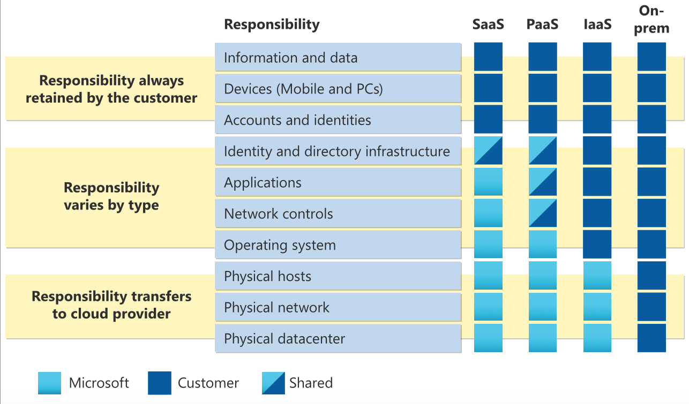
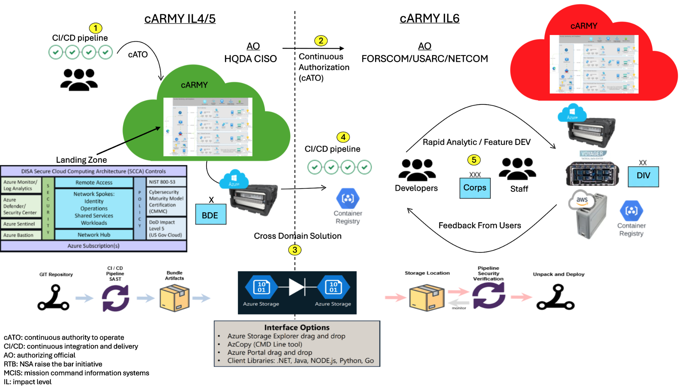
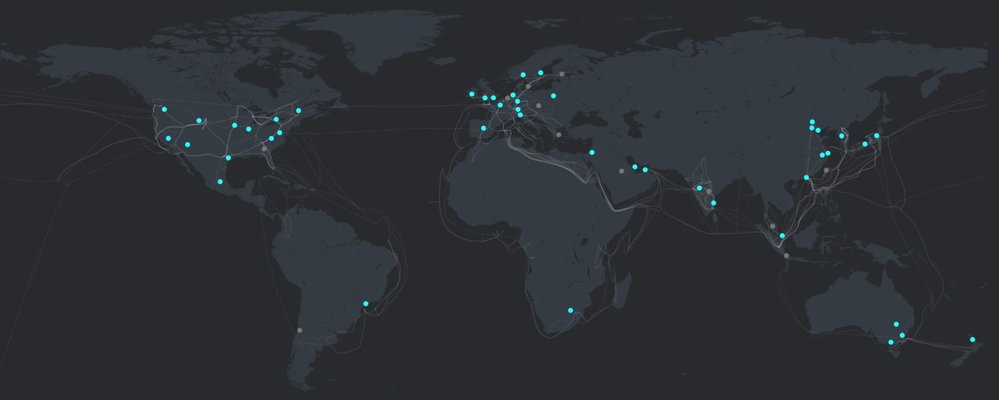

## Lunch and Learn Schedule

| Session Number | Date       | Session Title                                             | Relevant Certification                    |
|----------------|------------|-----------------------------------------------------------|-------------------------------------------|
| 1              | 2025-01-23 | Azure Fundamentals: Introduction to Cloud Computing and Azure | Azure Fundamentals (AZ-900)              |
| 2              | 2025-02-03 | Azure Fundamentals: Core Azure Services                   | Azure Fundamentals/Administrator (AZ-900/AZ-104)              |
| 3              | 2025-02-06 | Azure Fundamentals: Security, Privacy, Compliance, and Trust in Azure | Azure Security Engineer Associate (SC-900) |
| 4              | 2025-02-20 | Azure DevOps: Introduction to DevOps and Azure DevOps     | Azure DevOps Engineer Expert (AZ-400)       |
| 5              | 2025-03-06 | Azure DevOps: Continuous Integration and Continuous Delivery | Azure DevOps Engineer Expert (AZ-400/AZ-204)   |
| 6              | 2025-03-20 | Azure DevOps: Infrastructure as Code with Terraform       | Azure DevOps Engineer Expert (AZ-400)   |

## Agenda

- **[Overview of cloud computing concepts](#overview-of-cloud-computing-concepts) (10 minutes)**
  - IaaS, PaaS, SaaS, metered services, scalability
- **[Introduction to Microsoft Azure](#introduction-to-microsoft-azure) (10 minutes)**
  - Azure portal, Azure services, Azure regions
- **[Cost management](#cost-management)**
  - Subscription, budgets, cost analysis tools
- **[Demo](#demo)**
  - Interact with Azure using Portal/Cloud Shell/PowerShell/Azure CLI (15 minutes)**
- **Q&A (15 minutes)**

## Overview of cloud computing concepts

  
  

 

### Cloud Deployment Models Comparison
| **Public Cloud**                                  | **Private Cloud**                                   | **Hybrid Cloud**                                   |
|----------------------------------------------------|-----------------------------------------------------|----------------------------------------------------|
| portal.azure.com / portal.azure.us                 | portal.azurestack.local                             | portal.azure.com + portal.local.azurestack.external                                   |
| No capital expenditures to scale up                | Organizations have complete control over resources and security | Provides the most flexibility                      |
| Applications can be quickly provisioned and deprovisioned | Data is not collocated with other organizations’ data | Organizations determine where to run their applications |
| Organizations pay only for what they use           | Hardware must be purchased for startup and maintenance | Organizations control security, compliance, or legal requirements |
| Organizations don’t have complete control over resources and security | Organizations are responsible for hardware maintenance and updates |                                                    |

## Introduction to Microsoft Azure

  
  

- [Azure Datacenters](https://datacenters.microsoft.com/globe/explore)
- [Services by Scope/IL](https://learn.microsoft.com/en-us/azure/azure-government/compliance/azure-services-in-fedramp-auditscope)

## Use Cases for Specific Workloads that Benefit from Zonal Redundancy

Zonal redundancy ensures that your applications and data are resilient to failures within a single data center. Here are some specific workloads that benefit from zonal redundancy:

- **Mission-Critical Applications**
  - Applications that require high availability and cannot afford downtime, such as financial services, healthcare systems, and e-commerce platforms.
  
- **Data Storage and Databases**
  - Databases that need to maintain data integrity and availability, such as SQL databases, NoSQL databases, and data warehouses.

## Demo
Tasks:
 - login to azure portal and open cloud shell (bash)
 - upload terraform code to cloud storage
 - use vim to edit the code
 - terraform apply

## Questions

