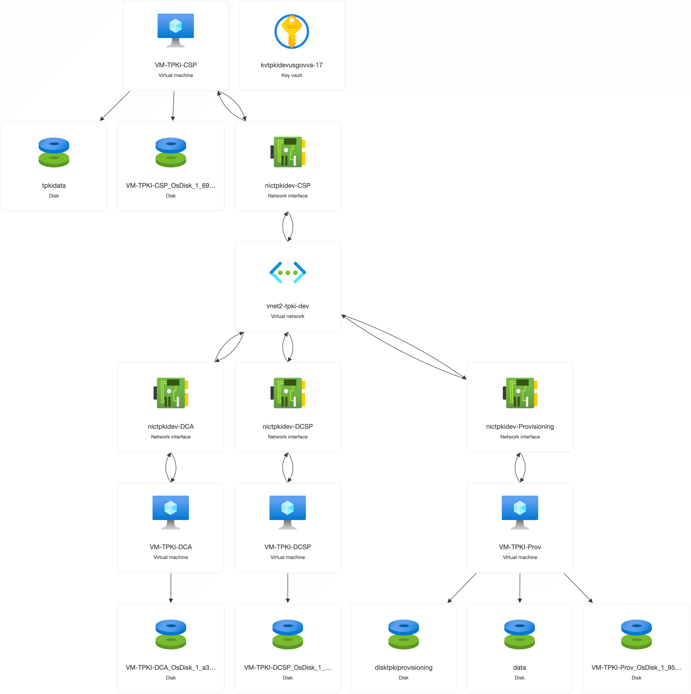
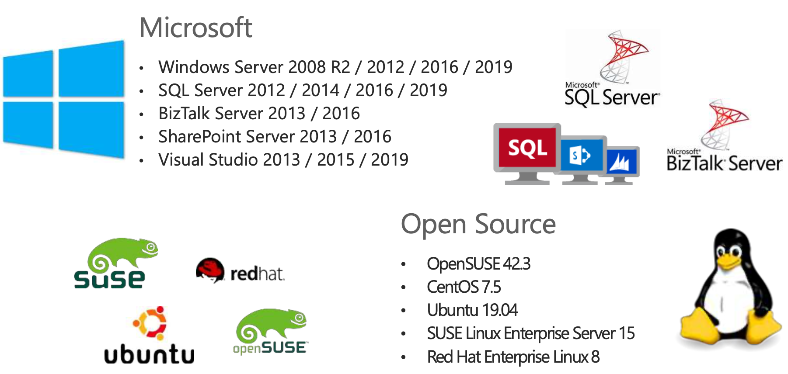

## Lunch and Learn Schedule

| Session Number | Date       | Session Title                                             | Relevant Certification                    |
|----------------|------------|-----------------------------------------------------------|-------------------------------------------|
| 1              | 2025-01-23 | Azure Fundamentals: Introduction to Cloud Computing and Azure | Azure Fundamentals (AZ-900)              |
| 2              | 2025-02-03 | Azure Fundamentals: Core Azure Services                   | Azure Fundamentals/Administrator (AZ-900/AZ-104)              |
| 3              | 2025-02-06 | Azure Fundamentals: Security, Privacy, Compliance, and Trust in Azure | Azure Security Engineer Associate (SC-900) |
| 4              | 2025-02-20 | Azure DevOps: Introduction to DevOps and Azure DevOps     | Azure DevOps Engineer Expert (AZ-400)       |
| 5              | 2025-03-06 | Azure DevOps: Continuous Integration and Continuous Delivery | Azure DevOps Engineer Expert (AZ-400/AZ-204)   |
| 6              | 2025-03-20 | Azure DevOps: Infrastructure as Code with Terraform       | Azure DevOps Engineer Expert (AZ-400)   |

## Agenda

- **[Azure Resource Manager (ARM) Overview](#azure-resource-manager-arm-overview) (5 minutes)**
- **[Azure Storage](#azure-storage) (5 minutes)**
- **[Azure Virtual Machines](#azure-virtual-machines) (5 minutes)**
- **[Azure Networking](#azure-networking) (5 minutes)**
  - Virtual Network, Subnet, Network Security Group, Application Gateway, Load Balancer
- **[Azure App Services (Web Apps, App Service Plan)](#azure-app-services) (5 minutes)**
  - Web Apps, App Service Plan
- **[Demo](#demo) (10 minutes)**
  - Deploy a web app using Azure App Services (REST API / azurerm provider)
  - Edit html code using cloud shell and update web app
- **Q&A (15 minutes)**


## Azure Resource Manager (ARM) Overview
<div style="display: flex; justify-content: space-between;">
  
  <div style="display: flex; justify-content: space-between; align-items: center; height: 100%;">
    <div style="display: flex; flex-direction: column; align-items: center; padding: 10px;">
      
      
    </div>
  </div>
</div>

### ARM Template Structure

```json
{
  // The schema that defines the structure and validation of the ARM template
  "$schema": "https://schema.management.azure.com/schemas/2019-04-01/deploymentTemplate.json#",
  // The version of the template content
  "contentVersion": "1.0.0.0",
  // Parameters that can be provided when deploying the template to customize resource properties
  "parameters": {},
  // Variables that are used within the template to simplify expressions and avoid repetition
  "variables": {},
  // The resources to be deployed or managed by the template
  "resources": []
  // The outputs that are returned after the deployment is complete
  "outputs": {}
}
```
### ARM Template Example
```json
{
  "parameters": {
    "storageAccountType": {
      "type": "string",
      "defaultValue": "Standard_LRS",
      "allowedValues": [
        "Standard_LRS",
        "Standard_GRS",
        "Standard_ZRS",
        "Premium_LRS"
      ],
      "metadata": {
        "description": "Storage Account type"
      }
    }
  },
  "resources": [
    {
      "type": "Microsoft.Storage/storageAccounts",
      "apiVersion": "2019-04-01",
      "name": "[concat('storage', uniqueString(resourceGroup().id))]",
      "location": "[resourceGroup().location]",
      "sku": {
        "name": "[parameters('storageAccountType')]"
      },
      "kind": "StorageV2",
      "properties": {}
    }
  ],
  "outputs": {
    "storageAccountName": {
      "type": "string",
      "value": "[concat('storage', uniqueString(resourceGroup().id))]"
    }
  }
}
```
### Additional Resources

- [Azure Resource Manager Documentation](https://docs.microsoft.com/en-us/azure/azure-resource-manager/management/overview)
- [ARM Template Reference](https://docs.microsoft.com/en-us/azure/templates/)
- [Bicep Documentation](https://docs.microsoft.com/en-us/azure/azure-resource-manager/bicep/overview)
- [Terraform on Azure Documentation](https://learn.microsoft.com/en-us/azure/developer/terraform/)

## Azure Storage
<div style="display: flex; justify-content: space-between;">
    
    <div style="display: flex; flex-direction: column; align-items: center;">
      
      
    </div>
</div>

<div style="display: flex; justify-content: center; padding-top: 10px;">
  
</div>

## Azure Virtual Machines
<div style="display: flex; justify-content: space-between;">
    
    
</div>

<div style="display: flex; justify-content: center; padding-top: 10px;">
    
</div>

## Azure Networking
<div style="display: flex; justify-content: space-between;">
    
    
</div>

## Azure App Services
<div style="display: flex; justify-content: space-between;">
    ß
</div>

## Demo
Tasks:
 - login to azure portal and open cloud shell (bash)
 - Deploy a VM using cloud shell (terraform)
 - Deploy a web app using Azure App Services (REST API / azurerm provider)